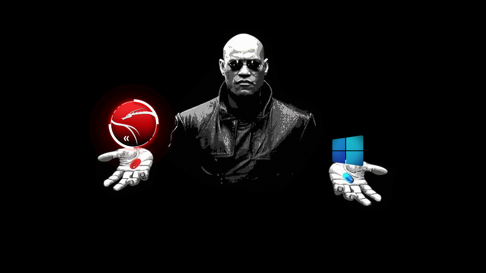

# FALLOUT GRUB Theme (Kali & Windows 11)

**Red Pill vs Blue Pill**

A minimalist Matrix-inspired GRUB theme featuring full-screen dynamic backgrounds that change between Kali Linux and Windows.

This is a modified version of the original work by [@Priyank-Adhav](https://github.com/Priyank-Adhav/Matrix-Morpheus-GRUB-Theme). I really loved the concept and just wanted the same for mine. All credits to the original author.

Changes Made:

- Replaced the Arch Linux icon with the Red Kali Icon
- Replaced Windows icon with a new better Windows 11 icon
- Modified the install script to work with Kali's default theme config file by modifying the theme location
- Changed Kali grubs default scaled in GFXMode to your displays actual resolution
- Replaced Kali's default splash screen to the morpheus image without hands.
- Added some credits and editing notes

---

**Note:**  
Currently, the theme only includes the **Kali Linux** and **Windows** icons.

Also, while the icons are **arranged horizontally** on screen,  
you still navigate using the **Up** and **Down arrow keys** as in a normal GRUB menu.

---



Spash screen


## Installation

1. Clone the repo

```shell
git clone https://github.com/sankarlmao/FALLOUT-GRUB-Theme-KALI-WINDOWS.git
```

2. Go into the folder

```shell
cd Morpheus-GRUB-Theme-KALI-WINDOWS
```

3. Make the installer executable

```shell
chmod +x install.sh
```

4. Execute the installation script as admin

```shell
sudo ./install.sh
```

5. Reboot to test your new theme

---

Optional: Simplify Your GRUB Menu

I designed this theme for a two entry layout and haven't really thought about how to visually handle the additional entries.

If your GRUB menu currently has extra entries such as:

- “Advanced options for Kali Linux”
- “UEFI Firmware Settings”

I would recommend you remove the extra menu entries from the grub config if you don't use them.
